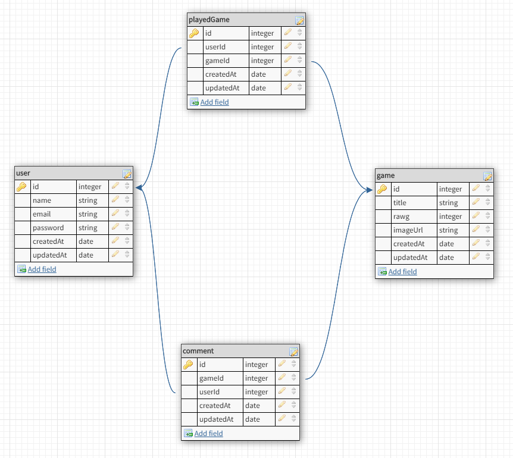

# Game Tracker App
Game app that tracks games you have played by searching RAWG.io API. It uses an express authentication template using Passport + flash messages + custom middleware. It uses Moment to get current date and date from seven days before to pull recent releases from API.

## What it includes

* Sequelize user, game, comment, and playedGame model / migration
* Settings for PostgreSQL
* Passport and passport-local for authentication
* Sessions to keep user logged in between pages
* Flash messages for errors and successes
* Passwords that are hashed with BCrypt
* EJS Templating and EJS Layouts

### User Model

| Column Name | Data Type | Notes |
| --------------- | ------------- | ------------------------------ |
| id | Integer | Serial Primary Key, Auto-generated |
| name | String | Must be provided |
| email | String | Must be unique / used for login |
| password | String | Stored as a hash |
| createdAt | Date | Auto-generated |
| updatedAt | Date | Auto-generated |

### Game Model

| Column Name | Data Type | Notes |
| --------------- | ------------- | ------------------------------ |
| id | Integer | Serial Primary Key, Auto-generated |
| title | String | Must be provided |
| rawg | Integer | Must be unique to create new entry |
| imageUrl | String | Must be provided |
| createdAt | Date | Auto-generated |
| updatedAt | Date | Auto-generated |

### playedGame Model

| Column Name | Data Type | Notes |
| --------------- | ------------- | ------------------------------ |
| id | Integer | Serial Primary Key, Auto-generated |
| userId | Integer | Must be provided |
| gameId | Integer | Must be provided |
| createdAt | Date | Auto-generated |
| updatedAt | Date | Auto-generated |

### Comment Model

| Column Name | Data Type | Notes |
| --------------- | ------------- | ------------------------------ |
| id | Integer | Serial Primary Key, Auto-generated |
| gameId | Integer | Must be provided |
| userId | Integer | Must be provided |
| comment | String | Must be provided |
| createdAt | Date | Auto-generated |
| updatedAt | Date | Auto-generated |

### ERD


### Default Routes

| Method | Path | Location | Purpose |
| ------ | ---------------- | -------------- | ------------------- |
| GET | / | server.js | Home page |
| GET | /auth/login | auth.js | Login form |
| GET | /auth/signup | auth.js | Signup form |
| POST | /auth/login | auth.js | Login user |
| POST | /auth/signup | auth.js | Creates User |
| GET | /auth/logout | auth.js | Removes session info |
| GET | /profile | server.js | Regular User Profile |

### Game Routes

| Method | Path | Location | Purpose |
| ------ | ---------------- | -------------- | ------------------- |
| GET | /games/results | games.js | Returns search results |
| GET | /games/played | games.js | Display games played |
| GET | /games/:id | games.js | Displays game details |
| POST | /games/played | games.js| Adds game to played |
| DELETE | /games | games.js | Deletes game from played |
| POST | /games/:id/comments | games.js | Adds comment to game |
| GET | /games/comments/edit/:id | games.js | Edit form for comment |
| PUT | /games/comments/:id | games.js | Edits comment |
| DELETE | /games/comments | games.js | Deletes comment |

## Steps To Use

#### 1. Go to repo on Github

Repo is found here: [game-tracker](https://github.com/tuanhrex/game-tracker). Alternatively, you can go to this website: [game-tracker-app](https://tuanh-game-tracker.herokuapp.com/)
* Go to the repo above
* `fork` and `clone` the repo


#### 2. Install node modules from the package.json

```
npm install
```

(Or just `npm i` for short)


#### 3. Update `config.json`

* Change the database name to whatever you like or keep it the same
* Other settings are likely okay, but check username, password, and dialect

#### 4. Create a new database for the new project

Using the sequelize command line interface, you can create a new database from the terminal.

```
createdb <new_db_name>
```


#### 5. Run the migrations

```
sequelize db:migrate
```

#### 6. Add a `.env` file with the following fields:

* SESSION_SECRET: Can be any random string; usually a hash in production
* PORT: Usually 3000 or 8000
* API_KEY: Can easily obtain one from [rawg.io](https://rawg.io/apidocs)

#### 7. Run server; make sure it works

```
nodemon
```

or

```
node index.js
```
