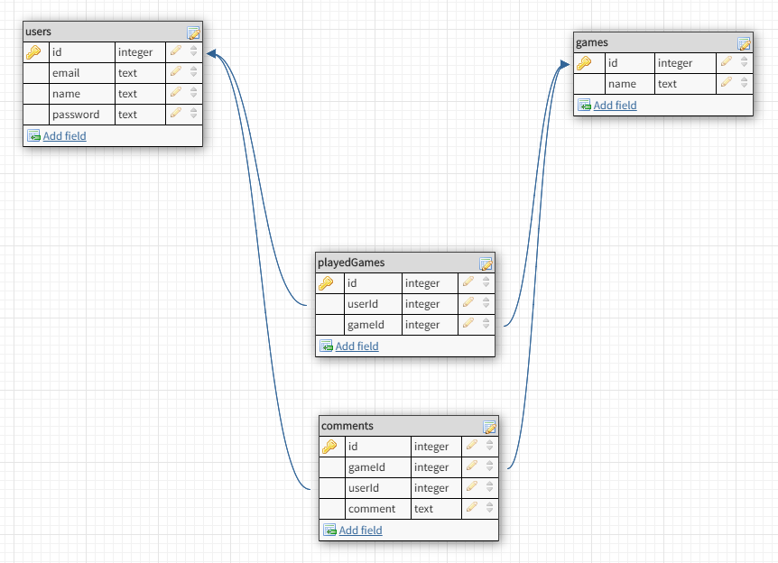
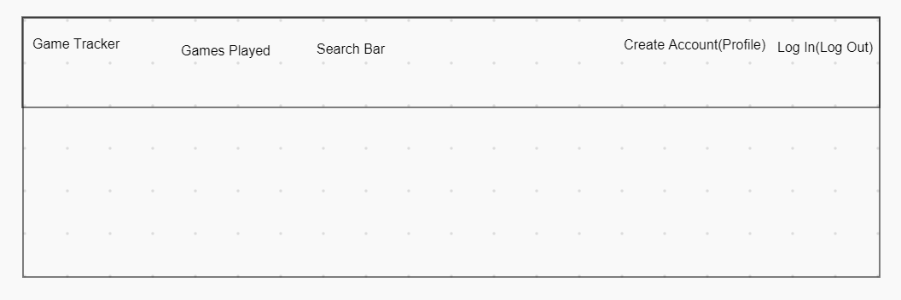

# Project 2 Planning

Fork & Clone this repo.

## Part 1

Review the [Project 2 requirements](https://romebell.gitbook.io/sei-1019/projects/project-2) and check out some [examples](https://tmdarneille.gitbook.io/seirfx/11-projects/past-projects/project2).

In this space below, list **THREE** ideas for your Project 2. For each idea, include [user stories](https://revelry.co/user-stories-that-dont-suck/) for each idea and a link to the API(s) you want to use for it.

--------------------------------------------------------
1. Game Tracker/ Track games owned and comment or review them/ https://rawg.io/apidocs
2. 
3.
---------------------------------------------------------

Make a PR when you're done!

---

## Part 2

In the space below:
* either embed or link a completed ERD for your approved P2 idea
* if there are any changes/additions to your user stories, place your full set of revised user stories here
* either embed or link wireframes for every page of your app

----------------------------------------------------------
### ERD

----------------------------------------------------------
### User Stories
* As a user, you will be able to create an account and log in.
* As a user, you will able to add games you have played and once added will be redirected to your played list.
* As a user, will be able to leave comments or reviews for the games you have played.

----------------------------------------------------------
### Wireframes

* Game Tracker will redirect you to homepage
* Games Played will take you to your list of games played or prompt you to log in if you're not logged in.
* Search bar will search the API for the game.
* Create Account (if not logged in) will take you to create account page. Profile will be visible if you are logged in and will take you take your profile page.
* Log in (if not logged in) will take you to log in page. If you are logged in, Log out will be visible and logs you out and redirect back to homepage.
----------------------------------------------------------

Make a PR when you're done!
